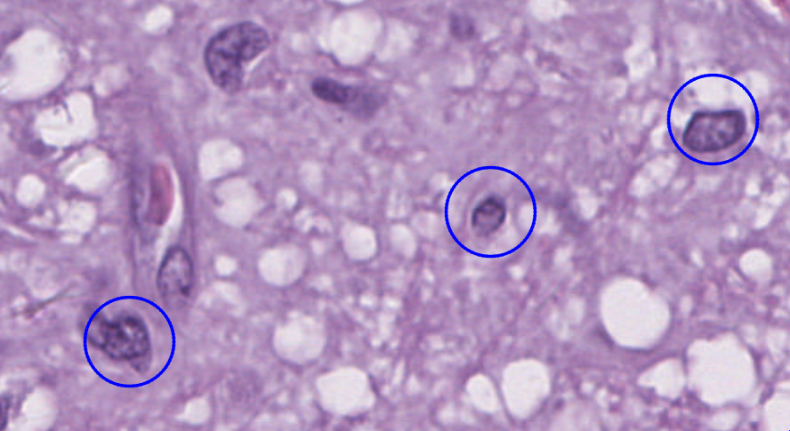
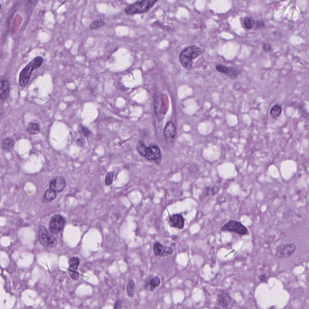
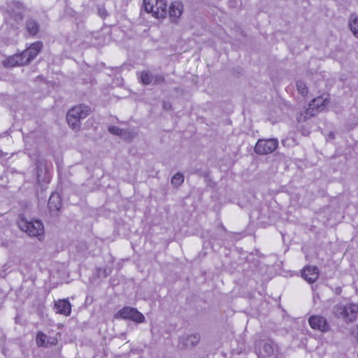
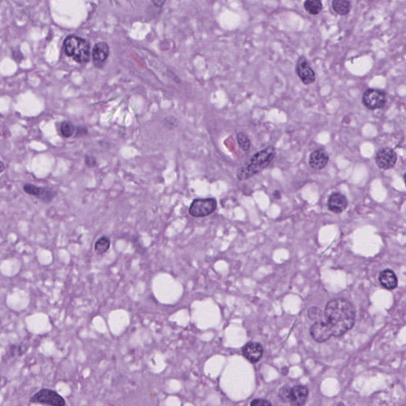

Generate patches from SlideRunner annotation database

https://github.com/maubreville/SlideRunner

```
$ python make_patch.py --sqlite roi-test.sqlite --wsidir /mnt/DATA/hanli-office-test/ --pngdir png-output
```

Currently supports:
* Spot Annotation

From



To

1             |  2 | 3
:-------------------------:|:-------------------------:|:-------------------------:
  |  | 
